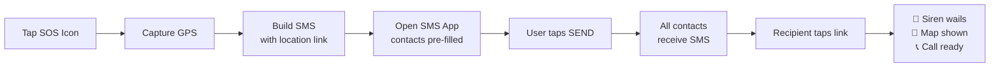

<p align="center">
  
</p>

<h1 align="center">🚨 SOS Alert</h1>

<p align="center">
  <strong>A zero-backend, one-tap emergency alert system.</strong><br/>
  Press a button on your phone → your trusted circle gets an SMS with your GPS location and a link.<br/>
  When they tap it, their phone screams a siren and shows your live position on a map.
</p>

<p align="center">
  
  
  
  
  
  
</p>

---

## ⚠️ Important Disclaimer

This is a **community safety tool**, **not** a replacement for professional emergency services. In a life-threatening situation, always call your country's emergency number first (112 / 911 / 102 / 100). Use this system as a supplementary alert layer to inform family, friends, and trusted contacts.

---

## 📖 What is this?

SOS Alert is a tiny, self-contained web application that turns a smartphone into a one-tap distress beacon. It was built for people who want a fast, private, no-app-installation-required way to alert a trusted circle in an emergency — military personnel deployed to remote areas, solo travelers, women's safety, hikers, elderly relatives, anyone really.

**Design principles:**

- **Zero backend.** No server to maintain, no database to leak. Static HTML on GitHub Pages.
- **Zero tracking.** No analytics, no third-party scripts (except Google Fonts).
- **Privacy by default.** Emergency contacts live in the sender's browser via `localStorage`. Never uploaded.
- **Universal recipient.** Recipients need no app, no account, no install — just a phone that receives SMS and has any browser.
- **Resilient.** Page works on weak data connections; siren is generated client-side (with an MP3 fallback).

---

## 🎬 How it works



Two pages do everything:

| File | Role | Who opens it |
|---|---|---|
| `send.html` | The sender PWA. Big red button. Captures GPS, opens SMS app pre-filled with all circle numbers and a link to the viewer. | **You**, the person in trouble. |
| `index.html` | The viewer page. Reads location/name/phone from the URL params. Plays siren, shows interactive map, big "Open in Maps" and "Call" buttons. | **Recipients**, when they tap the SMS link. |

The link itself carries all the data as URL parameters (`?lat=...&lng=...&n=...&p=...&t=...`), which means **no backend is ever needed**.

---

## ✨ Features

- 🚨 **One-tap SOS** — single big red button, no menus to navigate in panic
- 📍 **Live GPS** — captured on tap via browser geolocation
- 📣 **Loud siren on recipient's phone** — two-tone emergency wail (MP3 with Web Audio fallback)
- 🗺️ **Embedded interactive map** — recipient sees pin without leaving the page
- 📞 **One-tap call back** — `tel:` link auto-dials your callback number
- 📱 **PWA installable** — appears as a real app icon on home screen
- 🔒 **Local-only contacts** — saved in browser `localStorage`, never uploaded anywhere
- 💾 **Backup & restore** — export/import contacts as a JSON file
- 📳 **Phone vibration** — works even when audio is restricted
- 🌐 **Works on any modern phone** — iOS Safari, Android Chrome, Samsung Internet, Firefox Mobile
- 💸 **Completely free** — hosted on GitHub Pages, no domain or server costs required

---

## 🚀 Quick Start

### Step 1 — Deploy your own copy

1. **Fork this repository** (or click *Use this template*)
2. Go to **Settings → Pages**
3. Source: **Deploy from a branch** → Branch: **`main`** / **`/ (root)`** → Save
4. Wait ~2 min for the green ✓
5. Your URLs are now:
   - Sender PWA: `https://<your-username>.github.io/sos/send.html`
   - Viewer page: `https://<your-username>.github.io/sos/`

### Step 2 — Configure your emergency circle

1. Open the sender URL on your phone
2. Fill in your name + your phone number (with country code, no `+`)
3. Add each emergency contact (name + phone with country code)
4. Tap **Save & Continue**
5. Tap **Export Backup** and save the `.json` file somewhere safe

### Step 3 — Install as a PWA

- **Android / Chrome:** ⋮ menu → **Install app**
- **iOS / Safari:** Share button → **Add to Home Screen**

The red SOS icon appears on your home screen. Tap it like any app.

### Step 4 — Test

1. Add yourself as the only contact (temporarily)
2. Tap the SOS button → check that SMS app opens with your number prefilled
3. Send to yourself → tap the link in the SMS → confirm siren, map, and call button work
4. Replace test contact with your real emergency circle

---

## 🎯 Custom Domain (Optional)

If you'd like a cleaner, persistent URL like `sos.yourdomain.com`:

1. Create a file named `CNAME` in this repo with one line: `sos.yourdomain.com`
2. In your DNS provider, add a CNAME record: `sos` → `<your-username>.github.io`
3. In repo Settings → Pages → set Custom Domain to `sos.yourdomain.com`
4. Enable **Enforce HTTPS**

A custom domain makes the SMS link look more trustworthy and stays the same even if you ever change your GitHub username.

---

## 📁 File Structure

```
sos/
├── index.html        # The viewer (recipient opens this from SMS)
├── send.html         # The sender PWA (you open this in emergencies)
├── manifest.json     # PWA manifest for home-screen install
├── icon-192.png      # App icon (small)
├── icon-512.png      # App icon (large, also used as logo)
├── siren.mp3         # 8-second loopable emergency siren (~95 KB)
└── README.md         # This file
```

That's the entire project. **Seven files. No build step. No dependencies.**

---

## 🔒 Privacy & Security

| Concern | What this project does |
|---|---|
| **Where are my contacts stored?** | Only in your phone's browser, via `localStorage`. Never uploaded, never seen by GitHub or any server. |
| **Does my location get logged?** | No. It's passed as a URL parameter inside the SMS to your contacts only. There is no analytics, no logging server. |
| **What if someone finds my SOS link?** | The link only reveals data for one specific emergency — your live GPS at that moment and your callback number. Don't reshare generated emergency URLs publicly. |
| **Is the connection encrypted?** | Yes. GitHub Pages enforces HTTPS by default. SMS itself is not E2E encrypted (a carrier-level concern). |
| **Third-party services?** | Google Fonts (for typography) and Google Maps embed iframe (only loaded when a location is shown). No trackers, no analytics. |

---

## 🌐 Browser Support

| Browser | Sender (PWA) | Receiver (Viewer) | Notes |
|---|---|---|---|
| Chrome Android | ✅ Full | ✅ Full | Best experience |
| Safari iOS | ✅ Full | ⚠️ Siren requires user tap | iOS blocks all autoplay audio |
| Samsung Internet | ✅ Full | ✅ Full | Tested |
| Firefox Mobile | ✅ Full | ✅ Full | Tested |
| In-app browsers (WhatsApp, Telegram, Instagram) | ⚠️ Use sparingly | ⚠️ May block audio | Recommend "Open in browser" |
| Desktop browsers | ❌ Won't open SMS | ✅ Viewer works | SMS URI scheme is mobile-only |

---

## 🛠️ Tech Stack

- **HTML / CSS / Vanilla JavaScript** — no frameworks, no build step
- **Web APIs:** Geolocation, Vibration, Web Audio (fallback), HTML5 Audio, LocalStorage, PWA Manifest
- **Fonts:** [Anton](https://fonts.google.com/specimen/Anton), [JetBrains Mono](https://fonts.google.com/specimen/JetBrains+Mono) (via Google Fonts)
- **Maps:** Google Maps Embed (no API key needed)
- **Hosting:** GitHub Pages
- **Audio:** FFmpeg-encoded MP3 with synthesized Web Audio API fallback

---

## ⚠️ Known Limitations

- **Multi-recipient SMS** — `sms:` URI scheme behavior varies between OEMs. Some Android phones may only prefill the first recipient and require manual selection of the rest. iOS usually handles multiple recipients correctly.
- **iOS audio autoplay** — Recipients on iPhone always need to tap an **ACTIVATE** button before the siren plays. Apple's autoplay policy is non-negotiable.
- **Background audio** — When the recipient taps "Open in Maps App", their browser tab is backgrounded and the siren typically stops. This is a platform limitation, not a bug.
- **Battery drain on long siren** — The looping siren will draw power. Designed to be silenced once help is acknowledged.
- **No SMS = no alert** — System depends on cellular SMS reaching the recipient. In total no-coverage zones, consider satellite SOS hardware (Garmin inReach, etc.).

---

## 🗺️ Roadmap

Ideas for future iterations:

- [ ] Live-location updates via lightweight WebSocket relay (Cloudflare Worker)
- [ ] Telegram bot fanout in parallel to SMS
- [ ] Recipient acknowledge → ping back to sender's phone
- [ ] Dead-man switch (auto-fire if phone stationary + unanswered)
- [ ] Multilingual UI (Hindi, etc.)
- [ ] Tasker companion profile for full one-tap automation including auto-call
- [ ] Battery & signal strength included in alert payload

PRs welcome.

---

## 🤝 Contributing

This is a community safety project. Contributions of any size are welcome:

1. Fork
2. Create a feature branch (`git checkout -b feature/your-feature`)
3. Commit your changes
4. Open a Pull Request

Please keep the **zero-backend, zero-dependency** philosophy intact — features that require a server or third-party SDK will be considered carefully.

---

## 📜 License

MIT License. See [LICENSE](LICENSE) file (or below).

```
MIT License

Copyright (c) 2026

Permission is hereby granted, free of charge, to any person obtaining a copy
of this software and associated documentation files (the "Software"), to deal
in the Software without restriction, including without limitation the rights
to use, copy, modify, merge, publish, distribute, sublicense, and/or sell
copies of the Software, and to permit persons to whom the Software is
furnished to do so, subject to the following conditions:

The above copyright notice and this permission notice shall be included in all
copies or substantial portions of the Software.

THE SOFTWARE IS PROVIDED "AS IS", WITHOUT WARRANTY OF ANY KIND, EXPRESS OR
IMPLIED, INCLUDING BUT NOT LIMITED TO THE WARRANTIES OF MERCHANTABILITY,
FITNESS FOR A PARTICULAR PURPOSE AND NONINFRINGEMENT. IN NO EVENT SHALL THE
AUTHORS OR COPYRIGHT HOLDERS BE LIABLE FOR ANY CLAIM, DAMAGES OR OTHER
LIABILITY, WHETHER IN AN ACTION OF CONTRACT, TORT OR OTHERWISE, ARISING FROM,
OUT OF OR IN CONNECTION WITH THE SOFTWARE OR THE USE OR OTHER DEALINGS IN THE
SOFTWARE.
```

---

## 👤 Author

Built and maintained by **[@medjaisss](https://github.com/medjaisss)**.

If this project helped you or a loved one, consider starring ⭐ the repo so others can find it.

---

<p align="center">
  <em>Stay safe. Help is one tap away.</em>
</p>
